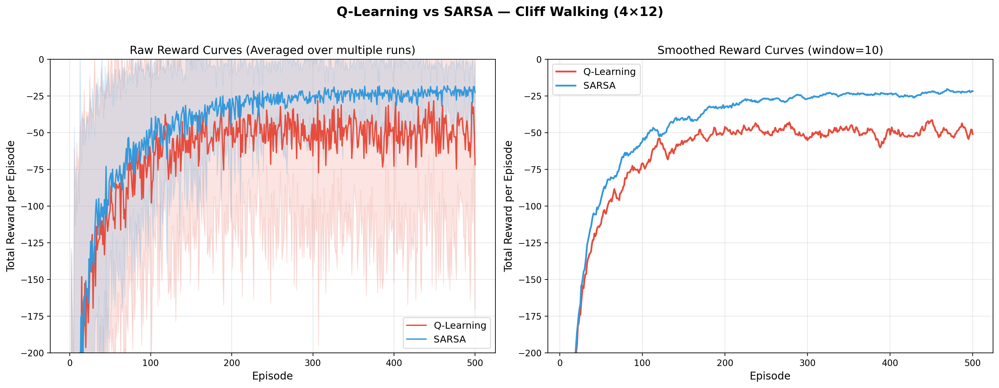
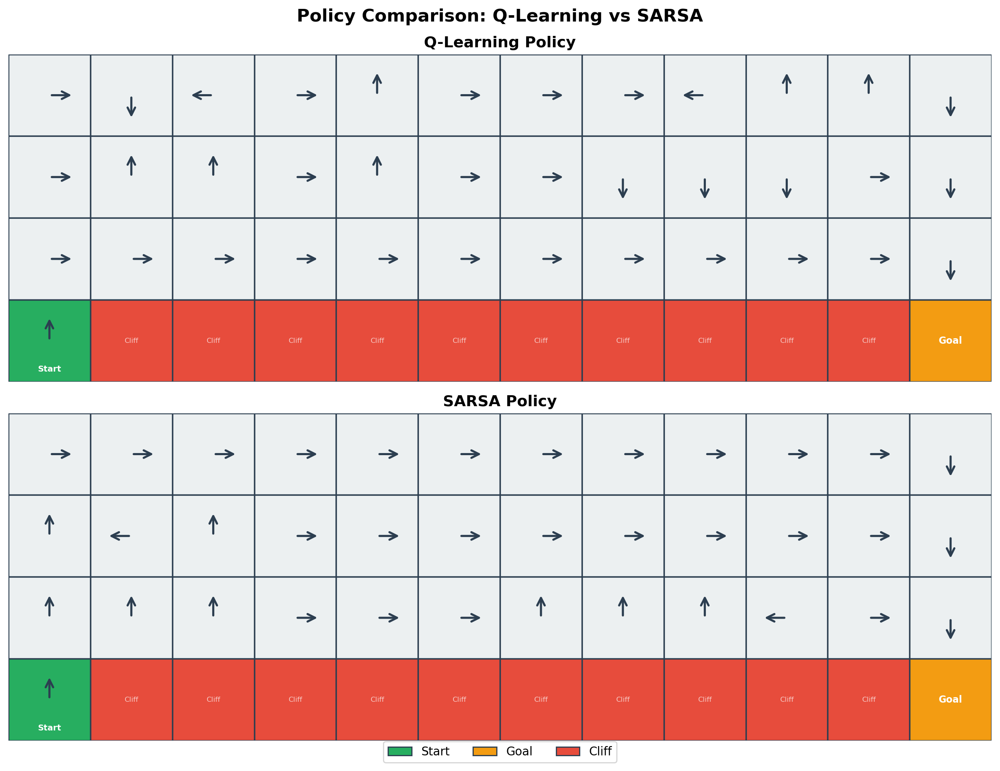
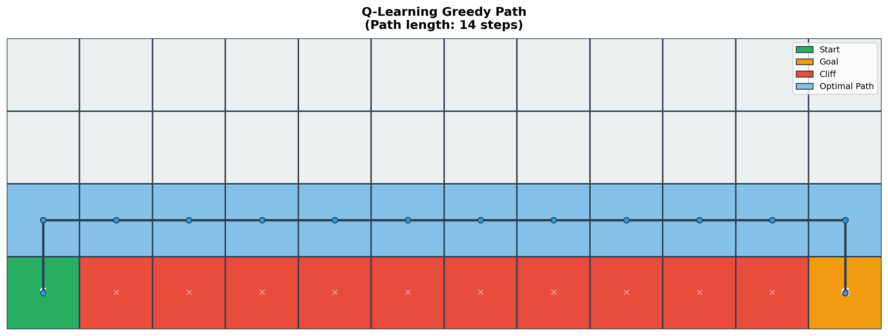
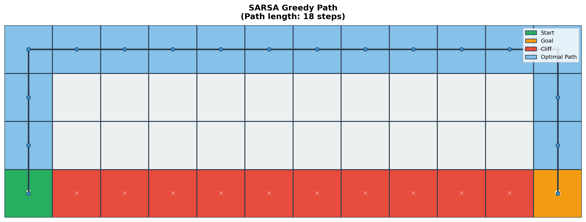
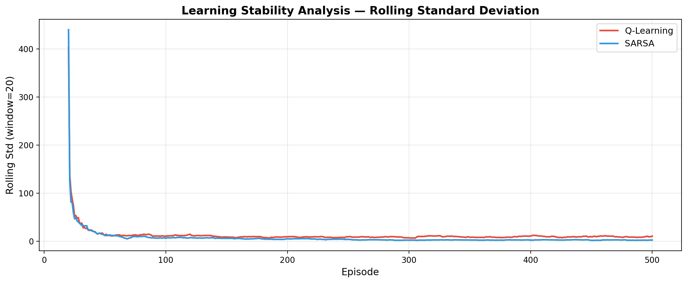
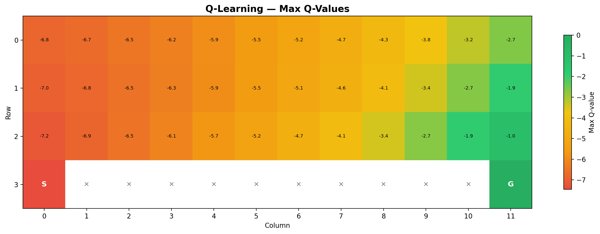
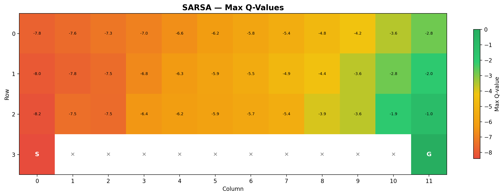
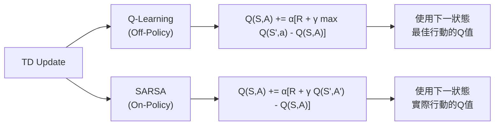

# Q-Learning vs SARSA — Cliff Walking 實驗報告

## 一、實驗設定

| 參數 | 值 |
|------|------|
| 環境 | 4×12 Cliff Walking Gridworld |
| 學習率 α | 0.1 |
| 折扣因子 γ | 0.9 |
| 探索率 ε | 0.1 (ε-greedy) |
| 訓練回合數 | 500 episodes |
| 獨立實驗次數 | 50 runs (取平均) |

---

## 二、學習表現分析

### 累積獎勵曲線



**關鍵觀察：**

| 指標 | Q-Learning | SARSA |
|------|-----------|-------|
| 最終平均獎勵 (後50回合) | -49.95 ± 9.79 | **-22.13 ± 2.72** |
| 最差單回合獎勵 | -456 | -179 |
| 最佳單回合獎勵 | -13 | -15 |
| 收斂回合 (avg > -50) | Episode 107 | **Episode 95** |

> [!IMPORTANT]
> SARSA 在訓練過程中獲得的平均獎勵**顯著優於** Q-Learning（約 -22 vs -50），這是因為 SARSA 學到了遠離懸崖的安全路徑，避免了因 ε-greedy 探索而掉入懸崖的損失。

### 收斂速度

- **SARSA 收斂更快**：在約 Episode 95 首次達到平均獎勵 > -50
- **Q-Learning 收斂較慢**：在約 Episode 107 達到相同標準
- SARSA 的收斂更為平穩，而 Q-Learning 即使在後期仍有大幅波動

---

## 三、策略行為分析

### 學習到的策略



### 最優路徑對比

````carousel

<!-- slide -->

````

| 特性 | Q-Learning | SARSA |
|------|-----------|-------|
| 路徑長度 | **14 步** (最短) | 18 步 |
| 路徑位置 | 懸崖正上方 (Row 2) | 頂部邊緣 (Row 0) |
| 風險程度 | **高** — 沿懸崖邊緣 | **低** — 遠離懸崖 |
| 策略傾向 | 冒險 (Optimal) | 保守 (Safe) |

> [!NOTE]
> **Q-Learning** 學到了理論最優路徑（沿著懸崖正上方一行走），但由於 ε-greedy 策略中 10% 的隨機探索，agent 在執行時有較高機率掉入懸崖。
>
> **SARSA** 則學到了在 ε-greedy 策略下「實際最優」的路徑 — 繞行頂部，即使路徑較長，但幾乎不會掉入懸崖。

---

## 四、穩定性分析



**穩定性結論：**
- **SARSA 明顯更穩定**：標準差收斂至極低值，學習過程波動小
- **Q-Learning 持續不穩定**：即使在 500 回合後，仍有顯著波動
- Q-Learning 的不穩定性來源：greedy 策略走的是懸崖邊緣，但 ε-greedy 的隨機探索會導致掉落，造成 -100 的大懲罰

### Q-Value 熱力圖

````carousel

<!-- slide -->

````

---

## 五、理論比較與討論

### Off-Policy vs On-Policy 的核心差異



| 面向 | Q-Learning (Off-Policy) | SARSA (On-Policy) |
|------|------------------------|-------------------|
| 更新依據 | 下一狀態的**最佳可能行動** | 下一狀態的**實際採取行動** |
| 目標策略 | 學習最優策略 π* | 學習當前策略的價值 |
| 探索影響 | 不受探索策略影響 | **直接反映探索策略** |
| 收斂目標 | Q* (最優 Q 函數) | Q_π (當前策略的 Q 函數) |

### 為何結果不同？

> [!TIP]
> **關鍵理解**：Q-Learning 和 SARSA 的差異本質在於「更新時是否考慮探索」。
>
> - Q-Learning 更新時用 `max Q(S', a)`，忽略了 agent 實際可能因 ε-greedy 而選擇隨機動作這件事
> - SARSA 更新時用 `Q(S', A')`，其中 A' 是 ε-greedy 實際選出的動作，因此它「知道」探索可能帶來危險

這導致：
1. **Q-Learning** 認為懸崖邊的狀態很安全（因為最優動作不會掉下去），所以學到了沿懸崖走的路徑
2. **SARSA** 認為懸崖邊的狀態有風險（因為 10% 的隨機動作可能掉下去），所以學到了遠離懸崖的路徑

---

## 六、結論

### 1. 收斂速度
- **SARSA 收斂更快**（Episode 95 vs 107），因為安全路徑的獎勵更穩定

### 2. 穩定性
- **SARSA 顯著更穩定**：波動小、標準差低
- Q-Learning 即使收斂後仍因掉落懸崖而產生大幅波動

### 3. 路徑最優性
- **Q-Learning 學到理論最優路徑**（最短路徑，14步）
- SARSA 學到在 ε-greedy 下的「實際最優路徑」（18步但更安全）

### 4. 何時選擇哪種方法？

| 情境 | 推薦方法 | 原因 |
|------|---------|------|
| 需要理論最優策略 | Q-Learning | 學到的是真正的最優策略 |
| 訓練過程中重視安全 | **SARSA** | 避免高代價的錯誤 |
| 環境風險高、錯誤代價大 | **SARSA** | 更保守、更穩定 |
| 訓練後使用純 greedy 策略 | Q-Learning | 部署時不探索，最短路徑最優 |
| 需要快速穩定收斂 | **SARSA** | 訓練過程波動更小 |
| 機器人控制、醫療 AI | **SARSA** | 探索階段也需確保安全 |

> [!IMPORTANT]
> **最終結論**：在 Cliff Walking 問題中，SARSA 在訓練過程中表現更優（更高的平均獎勵、更快收斂、更穩定），因為它在探索策略下學到的路徑更加安全。而 Q-Learning 雖然學到了理論最優路徑，但在使用 ε-greedy 策略執行時會因隨機探索而掉入懸崖，導致表現不佳。這完美詮釋了 On-Policy 與 Off-Policy 方法的本質差異。
